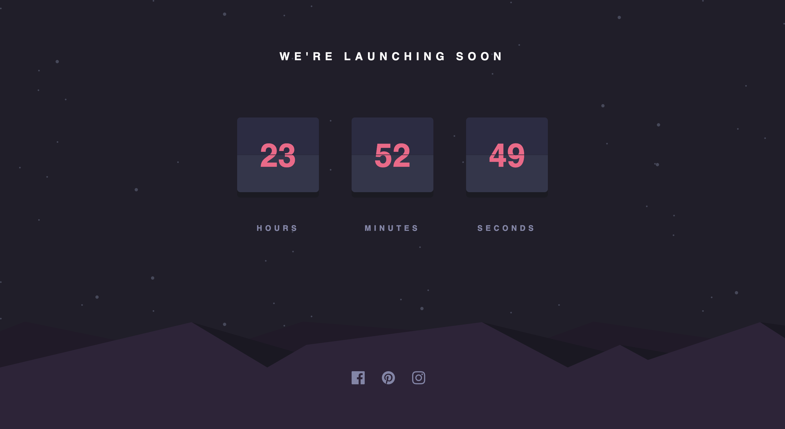

# Frontend Mentor - Launch countdown timer solution

This is a solution to the [Launch countdown timer challenge on Frontend Mentor](https://www.frontendmentor.io/challenges/launch-countdown-timer-N0XkGfyz-). Frontend Mentor challenges help you improve your coding skills by building realistic projects. 

## Table of contents

- [Overview](#overview)
  - [The challenge](#the-challenge)
  - [Screenshot](#screenshot)
  - [Links](#links)
- [My process](#my-process)
  - [Built with](#built-with)
- [Author](#author)


### The challenge

Users should be able to:

- See hover states for all interactive elements on the page
- See a live countdown timer that ticks down every second (start the count at 14 days)
- **Bonus**: When a number changes, make the card flip from the middle


### Change color to the svgs

[Generator filter with hexadecimal color](https://codepen.io/sosuke/pen/Pjoqqp)

```css
filter: invert(56%) sepia(58%) saturate(3878%) hue-rotate(313deg) brightness(107%) contrast(97%);
```


### Screenshot




### Links

- Solution URL: [here](https://github.com/HectorMartinDama/launch-countdown-timer)
- Live Site URL: [here](https://launch-countdown-timer-plum.vercel.app/)

### Built with

- Flexbox
- CSS Grid
- Mobile-first workflow
- Partials
- [SASS/SCSS](https://sass-lang.com/) - SASS

## Author

- Frontend Mentor - [@HectorMartinDama](https://www.frontendmentor.io/profile/HectorMartinDama)
- Linkedin - [@Héctor Martín](http://linkedin.com/in/héctor-martín-a88a761a2)
